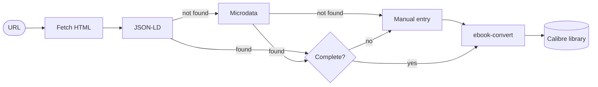

# Import Recipe — Calibre Plugin

Adds an **Import Recipe** toolbar button to Calibre. Click it, paste one or
more recipe blog URLs, and each recipe is fetched, stripped of ads and clutter,
converted to a clean EPUB, and added to your library — ready to send to your
e-reader.

## How it works



Extraction tries Schema.org structured data in two formats:

1. **JSON-LD** (`<script type="application/ld+json">`) — used by most modern recipe sites
2. **Microdata** (`itemscope`/`itemprop`) — used by WordPress Jetpack and others;
   also detects the hRecipe `e-instructions` class for sites that omit `itemprop`
   on their directions block

If neither format is found, or if ingredients or instructions are empty after
extraction, a **manual entry dialog** opens pre-filled with whatever metadata
(title, description, cover image) could be pulled from the page's Open Graph
tags.

## Requirements

- **Calibre 5+** (the plugin uses the new-API db and PyQt5)
- Internet access from the machine running Calibre (to fetch pages and cover images)

## Installation

1. Build the plugin zip:
   ```
   python build.py
   ```
   This creates `dist/import_recipe.zip`.

2. In Calibre: **Preferences → Plugins → Load plugin from file**,
   select `dist/import_recipe.zip`, click **Yes** on the security prompt.

3. Restart Calibre.

4. Right-click the toolbar → **Customize toolbar** → drag
   **Import Recipe** from the available actions into the toolbar.

## Usage

1. Click **Import Recipe** in the toolbar.
2. Paste a recipe URL into the first text field. Click **+ Add URL** for
   additional recipes.
3. Choose your duplicate policy (ask / skip / replace).
4. Click **Import**. A **preview dialog** appears for each recipe showing the
   rendered title, metadata, ingredients, and instructions — confirm or cancel
   before it's added to the library.
5. If no structured data is found, or if ingredients or instructions are
   missing, a **manual entry dialog** opens instead. It is pre-filled with
   the page title and any fields that were extracted; paste the missing text
   (one item per line) and click **Import**.
6. New books appear in your library immediately after import.

## What gets imported

Structured data is read from three sources, tried in order:

- **[Schema.org Recipe — JSON-LD](https://schema.org/Recipe)** (`<script type="application/ld+json">`) — the most common format on modern recipe sites; recipe data is embedded as a separate JSON blob in the page `<head>`
- **[Schema.org Recipe — Microdata](https://schema.org/Recipe)** (`itemscope`/`itemprop` attributes) — an older format where structured data is annotated directly on the visible HTML elements; used by WordPress Jetpack and others. Also recognises the [hRecipe](https://microformats.org/wiki/hrecipe) `e-instructions` class for sites that omit `itemprop` on their directions block
- **[Open Graph](https://ogp.me)** (`og:title`, `og:description`, `og:image`) — social-sharing metadata present on almost every page; used as fallback when structured recipe data is absent or incomplete

| Field | Source |
|---|---|
| Title | JSON-LD / microdata `name`; falls back to Open Graph `og:title` |
| Author | Author override if set (see Preferences), otherwise JSON-LD / microdata `author`, otherwise `og:site_name` / domain |
| Tags | JSON-LD / microdata `recipeCategory`, `recipeCuisine`, `keywords` |
| Comments | JSON-LD / microdata `description` + source URL; falls back to `og:description` |
| Cover | JSON-LD / microdata `image`; falls back to `og:image` (Calibre thumbnail only, not in book body) |
| Ingredients | JSON-LD / microdata `recipeIngredient` |
| Instructions | JSON-LD / microdata `recipeInstructions`; falls back to hRecipe `e-instructions` block, then post-recipe `<p>` tags |

> **Note:** the extraction sources above were developed against one person's bookmark list. There are doubtless other structured-data formats and site-specific patterns in the wild that aren't handled yet. PRs welcome.

## Configuration

Go to **Preferences → Plugins**, find **Import Recipe**, and click
**Customize plugin**.

| Setting | Default | Description |
|---|---|---|
| Author override | `Recipes` | When set, all imported books are filed under this author in Calibre, and the recipe's own author is appended to the title (e.g. "Blueberry Pancakes by Smitten Kitchen"). Leave blank to use the recipe's own author directly. |

## Limitations

- Sites that require JavaScript execution (Cloudflare, Vercel bot challenges,
  login walls) cannot be fetched. The manual entry dialog will open so you can
  paste the recipe text yourself.
- The plugin does not bypass paywalls; it behaves like a normal browser request.

## Development

All plugin source lives in `calibre_plugin/`. Tests live in `tests/`.

```bash
python -m pytest tests/ -q   # run the test suite
python build.py              # build dist/import_recipe.zip for release
```

On macOS with Calibre installed in `/Applications`:

```bash
make reload   # install plugin, kill Calibre, relaunch
make test     # run the test suite
make dist     # build the release zip
```

`make reload` uses `calibre-customize -b calibre_plugin` (no zip needed), then
kills and restarts the app.

### Previewing extraction without Calibre

`preview_recipe.py` runs the same extraction and rendering code as the plugin
and writes the result to a local HTML file — no Calibre installation required:

```bash
python preview_recipe.py https://example.com/chocolate-cake
open recipe.html          # macOS
```

Use this to quickly check whether a site's structured data is readable before
importing, or to inspect the rendered layout.
